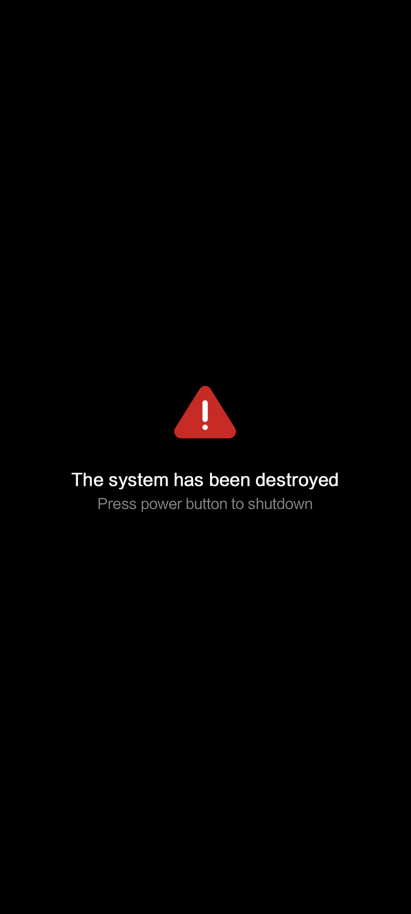
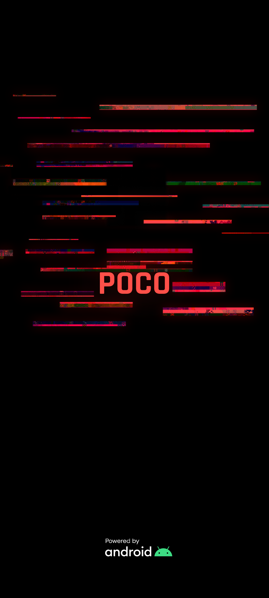
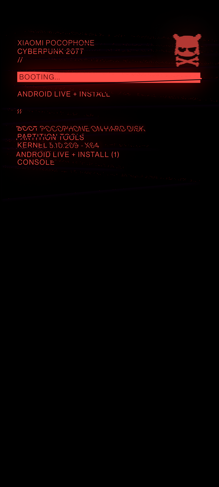
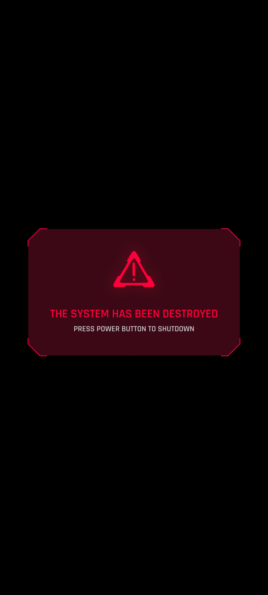

**Idiomas**: [English](README.md) | [Русский](README.ru.md) | [Español](README.es.md) | [Français](README.fr.md) | [Português](README.pt.md) | [中文](README.zh.md)
# Bootanimation y Pantalla de Inicio de Cyberpunk 2077 para POCO

Este módulo de Magisk reemplaza la animación de inicio predeterminada con una animación al estilo Cyberpunk 2077, inspirada en el **OnePlus 8T Cyberpunk 2077 Edition** y adaptada especialmente para **POCO**. También incluye una **pantalla** de inicio personalizada opcional.

---

### Animación original:
<table>
  <tr>
    <td></td>
    <td></td>
    <td></td>
  </tr>
</table>

### Versión adaptada para POCO:
<table>
  <tr>
    <td></td>
    <td></td>
    <td></td>
  </tr>
</table>

---

### Compatibilidad
Este módulo funciona en cualquier dispositivo (no solo POCO) con **Magisk 20.4+**, siempre que la animación de inicio se encuentre en una de estas rutas:

```
/system/media/bootanimation.zip
/system/product/media/bootanimation.zip
/system/system_ext/media/bootanimation.zip
/product/media/bootanimation.zip
/vendor/media/bootanimation.zip
```

Si la animación no se cambió en tu dispositivo, [contáctame en Telegram](https://t.me/mbczqetuo) para que pueda agregar soporte para el directorio de animación de tu dispositivo.

---

### Instalación

 1. [Descarga el módulo desde Releases](https://github.com/ENEIZEM/Magisk-Module-Cyberpunk-2077-Bootanimation-SplashScreen-POCO/releases)
 2. Abre la aplicación Magisk
 3. Ve a la pestaña **«Módulos»** y selecciona el archivo `.zip` descargado

### Registro multilingüe del instalador

El instalador muestra registros en **español, inglés, ruso, francés, chino o portugués**, según el idioma de tu sistema.

---

### Opcional: Pantalla de inicio
El módulo incluye un archivo `logo.zip` (generado con [esta herramienta](https://4pda.to/forum/index.php?showtopic=1023354&st=1580#entry114714184)) que contiene:

 * **Inicio (logo POCO)**
 * **FASTBOOT**
 * **Advertencia de sistema destruido**

Todas las pantallas han sido rediseñadas al estilo Cyberpunk 2077.

### Pantallas originales:
<table>
  <tr>
    <td></td>
    <td></td>
    <td></td>
  </tr>
</table>

### Versión Cyberpunk:
<table>
  <tr>
    <td></td>
    <td></td>
    <td></td>
  </tr>
</table>

---

### IMPORTANTE: Instalar Pantalla de Inicio

⚠️ La instalación de **pantallas de inicio** personalizadas solo se recomienda para **teléfonos Xiaomi**, ya que la herramienta utilizada para crearlas está diseñada específicamente para dispositivos Xiaomi (e incluso así, no todos los modelos son compatibles).
Probado en **POCO F4 GT** y **Redmi Note 12 Turbo (POCO F5)**.

Para flashear las imágenes personalizadas de Cyberpunk splash:

 1. Reinicia en **TWRP** u otro custom recovery
 2. Toca **«Instalar»**
 3. Navega a `/data/adb/modules/Cyberpunk_2077_BA_SS/`
 4. Selecciona `logo.zip` y flashea

---

### Feedback
¡No dudes en comunicarte si tienes ideas para mejoras, encuentras algún error o simplemente quieres compartir tus pensamientos!