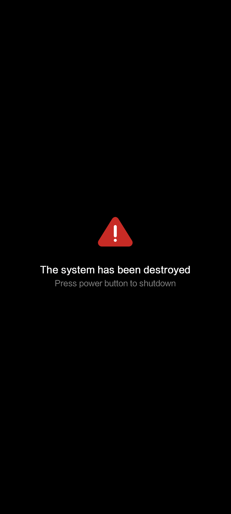
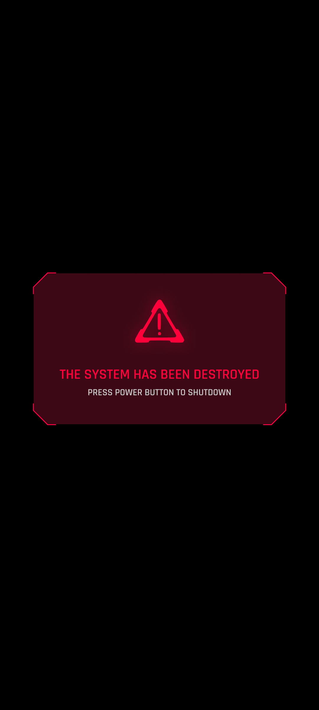

**Langues**: [English](README.md) | [Русский](README.ru.md) | [Español](README.es.md) | [Français](README.fr.md) | [Português](README.pt.md) | [中文](README.zh.md)
# Cyberpunk 2077 Bootanimation et Écran d'Accueil pour POCO

Ce module Magisk remplace l'animation de démarrage par une version Cyberpunk 2077, inspirée du **OnePlus 8T Cyberpunk 2077 Edition** et redessinée pour les appareils **POCO**. Un **écran d'accueil personnalisé** est également inclus en option.

---

### Animation originale:
<table>
  <tr>
    <td></td>
    <td></td>
    <td></td>
  </tr>
</table>

### Version modifiée pour POCO:
<table>
  <tr>
    <td></td>
    <td></td>
    <td></td>
  </tr>
</table>

---

### Compatibilité

Fonctionne avec tout appareil (pas seulement POCO) utilisant **Magisk 20.4+**, avec l'animation située dans l'un des chemins suivants :

```
/system/media/bootanimation.zip
/system/product/media/bootanimation.zip
/system/system_ext/media/bootanimation.zip
/product/media/bootanimation.zip
/vendor/media/bootanimation.zip
```

Si l'animation ne change pas sur votre appareil, [contactez-moi sur Telegram](https://t.me/mbczqetuo) pour que je puisse ajouter la prise en charge du répertoire d'animation de votre appareil.

---

### Installation

 1. [Téléchargez le module depuis la page des Releases](https://github.com/ENEIZEM/Magisk-Module-Cyberpunk-2077-Bootanimation-SplashScreen-POCO/releases)
 2. Ouvrez l'application Magisk
 3. Allez dans l'onglet **«Modules»** et sélectionnez le fichier `.zip` téléchargé


### Journal d'installation multilingue
Le processus d'installation affiche des messages en **français, anglais, espagnol, russe, chinois ou portugais** selon la langue de votre système.

---

### Optionnel: Écran d'accueil (Splash)
Le fichier `logo.zip` inclus (généré avec [cet outil](https://4pda.to/forum/index.php?showtopic=1023354&st=1580#entry114714184)) contient des écrans personnalisés :

 * **Écran de démarrage (logo POCO)**
 * **FASTBOOT**
 * **Avertissement de système détruit**

Tous sont adaptés au style Cyberpunk 2077.

### Originaux:
<table>
  <tr>
    <td></td>
    <td></td>
    <td></td>
  </tr>
</table>

### Versions Cyberpunk:
<table>
  <tr>
    <td></td>
    <td></td>
    <td></td>
  </tr>
</table>

---

### IMPORTANT: Installation de l'écran d'accueil

⚠️ L'installation d'écrans d'accueil personnalisés est uniquement recommandée pour les **téléphones Xiaomi**, car l'outil utilisé pour les créer est spécifiquement conçu pour les appareils Xiaomi (et même dans ce cas, tous les modèles ne sont pas pris en charge).
Testé sur **POCO F4 GT** et **Redmi Note 12 Turbo (POCO F5)**.

Pour flasher les images personnalisées Cyberpunk splash :

 1. Redémarrez en **TWRP** ou dans un autre recovery personnalisé
 2. Appuyez sur **«Installer»**
 3. Naviguez vers : `/data/adb/modules/Cyberpunk_2077_BA_SS/`
 4. Sélectionnez `logo.zip` et flashez

---

### Commentaires
N'hésitez pas à me contacter si vous avez des idées d'améliorations, rencontrez des bugs ou si vous souhaitez simplement partager vos réflexions!