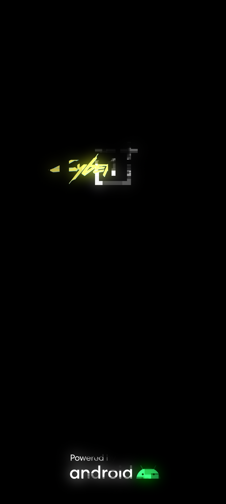
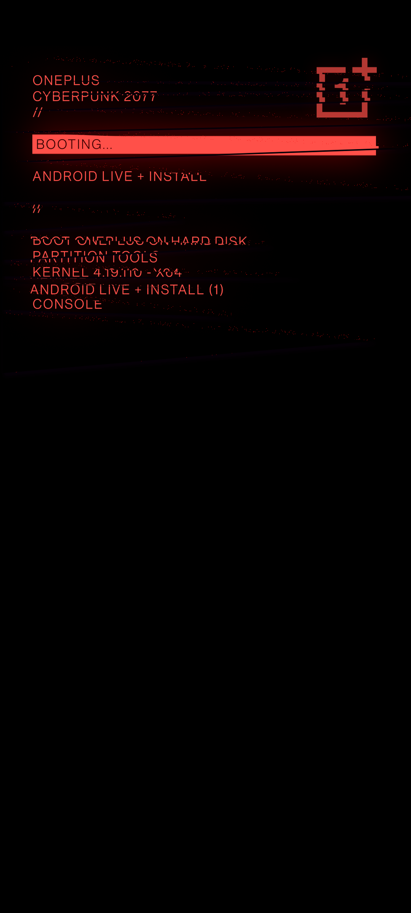

**Languages**: [English](README.md) | [Русский](README.ru.md) | [Español](README.es.md) | [Français](README.fr.md) | [Português](README.pt.md) | [中文](README.zh.md)
# Cyberpunk 2077 Bootanimation & Splashscreen for POCO

This Magisk module replaces the default boot animation with a Cyberpunk-style animation inspired by the **OnePlus 8T Cyberpunk 2077 Edition**, adapted specifically for **POCO**. An optional custom **splash screen** is also included.

---

### Original animation:
<table>
  <tr>
    <td></td>
    <td></td>
    <td></td>
  </tr>
</table>

### Redrawn animation for POCO:
<table>
  <tr>
    <td></td>
    <td></td>
    <td></td>
  </tr>
</table>

---

### Compatibility

This module works on any device running (not only POCO) **Magisk 20.4+** where the boot animation is located in one of the following paths:

```
/system/media/bootanimation.zip  
/system/product/media/bootanimation.zip  
/system/system_ext/media/bootanimation.zip  
/product/media/bootanimation.zip  
/vendor/media/bootanimation.zip  
```

If the animation isn't changed on your device, [contact me on Telegram](https://t.me/ENEIZEMatic), so I can add support for your device's animation directory.

---

### Installation

 1. [Download the module from Releases](https://github.com/ENEIZEM/Magisk-Module-Cyberpunk-2077-Bootanimation-SplashScreen-POCO/releases)
 2. Open the Magisk app
 3. Go to the **Modules** tab and select the downloaded `.zip` file

### Multilingual Installer Log

The installer shows logs in **English, Russian, Spanish, French, Chinese, or Portuguese**, based on your system language.

---

### Optional: Splash Screen

The module includes a `logo.zip` archive (generated with [this tool](https://4pda.to/forum/index.php?showtopic=1023354&st=1580#entry114714184)) containing:

 * **Splash (POCO logo)**
 * **FASTBOOT**
 * **Destroyed system warning**

All screens are redrawn in Cyberpunk 2077 style.

### Original Screens:
<table>
  <tr>
    <td></td>
    <td></td>
    <td></td>
  </tr>
</table>

### Cyberpunk Screens:
<table>
  <tr>
    <td></td>
    <td></td>
    <td></td>
  </tr>
</table>

---

> [!WARNING]
> Installing custom **splash screens** is only recommended for **Xiaomi phones**, as the tool used to create them is specifically designed for Xiaomi devices (and even then, not all models are supported). Flashing a custom logo on an unsupported device can cause critical hardware failures, potentially damaging the CPU and motherboard irreversibly.
>
> **Supported devices:**
> - MIUI versions 12.5–14
> - Android versions 11–13
>
> **Unsupported under any circumstances:**
> - Redmi Note 9, Redmi Note 9C and older
> - Redmi 9T and older
> - Mi 12, Mi 12 Pro and older
> - Xiaomi Mi 8 and older
> - Poco F4 GT and older
> - Redmi K50, Redmi K50G and older
>
> Before installing, check compatibility with the [author of the logo tool](https://t.me/theskyfather).

## To install custom logos (Splash, Fastboot, Destroyed system):

 1. Reboot into **TWRP** or another custom recovery  
 2. Tap **«Install»**  
 3. Navigate to `/data/adb/modules/Cyberpunk_2077_BA_SS/`  
 4. Select `logo.zip` and flash it  

---

### Feedback

Feel free to reach out if you have ideas for improvements, encounter any bugs, or just want to share your thoughts!

[Support the project financially](https://www.donationalerts.com/r/eneizematic)