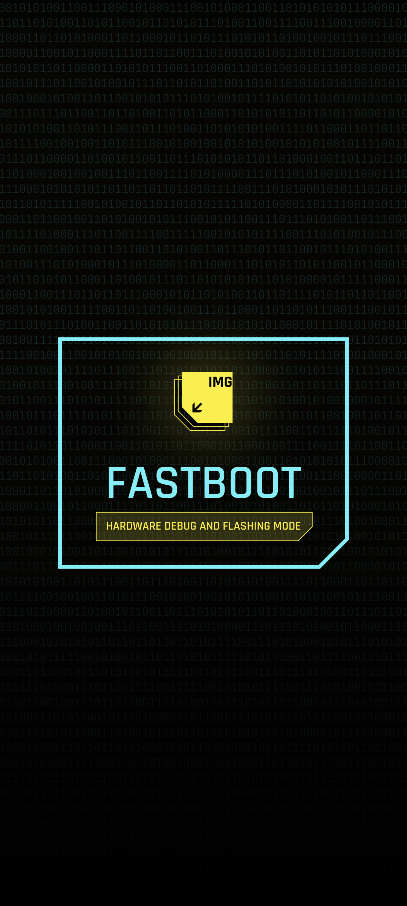

**Idiomas**: [English](README.md) | [Русский](README.ru.md) | [Español](README.es.md) | [Français](README.fr.md) | [Português](README.pt.md) | [中文](README.zh.md)
# Animação de Inicialização e Tela Splash do Cyberpunk 2077 para POCO

Este módulo Magisk substitui a animação padrão por uma versão no estilo Cyberpunk 2077, inspirada no **OnePlus 8T Edição Cyberpunk 2077** e adaptada para dispositivos **POCO**. Inclui também uma tela splash personalizada opcional.

---

### Animação original:
<table>
  <tr>
    <td></td>
    <td></td>
    <td></td>
  </tr>
</table>

### Versão redesenhada para POCO:
<table>
  <tr>
    <td></td>
    <td></td>
    <td></td>
  </tr>
</table>

---

### Compatibilidade

Compatível com qualquer dispositivo (não apenas POCO) com **Magisk 20.4+** e bootanimation em um dos seguintes caminhos:

```
/system/media/bootanimation.zip
/system/product/media/bootanimation.zip
/system/system_ext/media/bootanimation.zip
/product/media/bootanimation.zip
/vendor/media/bootanimation.zip
```

Se nada mudou, [fale comigo no Telegram](https://t.me/ENEIZEMatic) para que eu possa adicionar suporte ao diretório de animação do seu dispositivo.

---

### Como instalar

 1. [Baixe o módulo pela página de Releases](https://github.com/ENEIZEM/Magisk-Module-Cyberpunk-2077-Bootanimation-SplashScreen-POCO/releases)
 2. Abra o aplicativo Magisk
 3. Vá até a aba **“Módulos”** e selecione o arquivo `.zip` baixado

### Instalação com suporte multilíngue

Durante a instalação, as mensagens aparecerão em **português, inglês, espanhol, francês, russo ou chinês**, dependendo do idioma do sistema.

---

### Splash Screen (opcional)
O arquivo `logo.zip` incluído (gerado com [essa ferramenta](https://4pda.to/forum/index.php?showtopic=1023354&st=1580#entry114714184)) contém:

 * **Tela de boot (logo POCO)**
 * **FASTBOOT**
 * **Sistema destruído**

Todos redesenhados no estilo Cyberpunk 2077.

### Telas originais:
<table>
  <tr>
    <td></td>
    <td></td>
    <td></td>
  </tr>
</table>

### Telas Cyberpunk:
<table>
  <tr>
    <td></td>
    <td></td>
    <td></td>
  </tr>
</table>

---

> [!WARNING]
> A instalação de **telas splash** personalizadas é recomendada **apenas para telefones Xiaomi**, pois a ferramenta usada para criá-las é feita especificamente para dispositivos Xiaomi (e mesmo assim, nem todos os modelos são suportados).
> Flashar logos personalizados em dispositivos incompatíveis pode causar falhas críticas de hardware, inclusive danos irreversíveis à CPU e placa-mãe.
>
> **Dispositivos suportados:**
> - MIUI versões 12.5–14
> - Android versões 11–13
>
> **Não suportado de forma alguma:**
> - Redmi Note 9, Redmi Note 9C e anteriores
> - Redmi 9T e anteriores
> - Mi 12, Mi 12 Pro e anteriores
> - Xiaomi Mi 8 e anteriores
> - Poco F4 GT e anteriores
> - Redmi K50, Redmi K50G e anteriores
>
> Antes de instalar uma nova logo, confira compatibilidade com o [autor da ferramenta de logo personalizada](https://t.me/theskyfather).

## Para instalar as logos personalizadas (Splash, Fastboot, Sistema destruído):

> 1. Reinicie em **TWRP** ou outro recovery personalizado
> 2. Toque em **«Instalar»**
> 3. Navegue até `/data/adb/modules/Cyberpunk_2077_BA_SS/`
> 4. Selecione `logo.zip` e flasheie

---

### Feedback

Sinta-se à vontade para entrar em contato se tiver ideias para melhorias, encontrar algum bug ou apenas quiser compartilhar seus pensamentos!

[Apoie financeiramente o projeto](https://www.donationalerts.com/r/eneizematic)