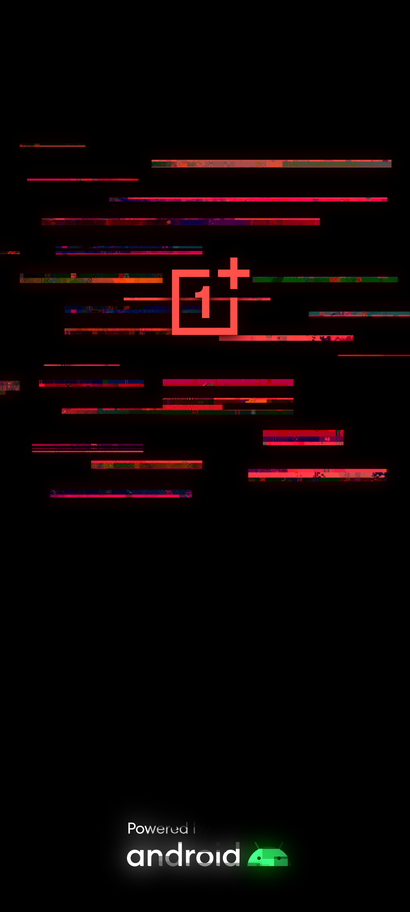

**Языки**: [English](README.md) | [Русский](README.ru.md) | [Español](README.es.md) | [Français](README.fr.md) | [Português](README.pt.md) | [中文](README.zh.md)
# Cyberpunk 2077 Bootanimation & Splashscreen для POCO

Этот Magisk-модуль заменяет стандартную анимацию загрузки на стильную киберпанковую из **OnePlus 8T Cyberpunk 2077 Edition**, адаптированную специально для **POCO**. Также доступен опциональный кастомный **Splash Screen**.

---

### Оригинальная анимация:
 

### Перерисованная версия под POCO:
 

---

### Совместимость

Этот модуль работает на любом устройстве (не только на POCO) с **Magisk 20.4+**, если файл анимации загрузки находится в одной из следующих директорий:

```
/system/media/bootanimation.zip
/system/product/media/bootanimation.zip
/system/system_ext/media/bootanimation.zip
/product/media/bootanimation.zip
/vendor/media/bootanimation.zip
```

Если анимация не изменилась, [свяжитесь со мной в Telegram](https://t.me/mbczqetuo), чтобы я мог добавить поддержку директории анимации вашего устройства.

---

### Установка

 1. [Скачайте модуль из раздела Releases](https://github.com/ENEIZEM/Magisk-Module-Cyberpunk-2077-Bootanimation-SplashScreen-POCO/releases)
 2. Откройте приложение Magisk
 3. Перейдите во вкладку **"Модули"** и выберите скачанный `.zip` файл

---

### Мультиязычный лог установки

Во время установки вы увидите лог на **русском, английском, испанском, французском, китайском или португальском** языке, в зависимости от языка вашей системы.

---

### Опционально: Splash Screen

В модуль включен архив `logo.zip` (созданный с помощью [этого инструмента](https://4pda.to/forum/index.php?showtopic=1023354&st=1580#entry114714184)), содержащий кастомные заставки:

 * **Splash (логотип POCO)**
 * **FASTBOOT**
 * **Предупреждение о поврежденной системе**

Все экраны перерисованы в стиле Cyberpunk 2077.

### Оригинальные заставки:
  

### Кастомные заставки:
  

---

### ВАЖНО: Установка Splash Screen

⚠️ Установка кастомных **Splash Screens** рекомендуется только для **телефонов Xiaomi**, так как инструмент для их создания разработан специально для устройств Xiaomi (и даже в этом случае поддерживаются не все модели).
Протестировано на **POCO F4 GT** и **Redmi Note 12 Turbo (POCO F5)**.

Чтобы установить кастомные заставки (Splash, Fastboot, Destroyed system):

 1. Перезагрузитесь в **TWRP** или другое кастомное рекавери
 2. Выберите **«Установка»**
 3. Перейдите в директорию: `/data/adb/modules/Cyberpunk_2077_BA_SS/`
 4. Выберите `logo.zip` и прошейте его

---

### Обратная связь
Вы можете написать мне с предложениями по улучшению, сообщением о найденных багах или просто поделиться мнением!