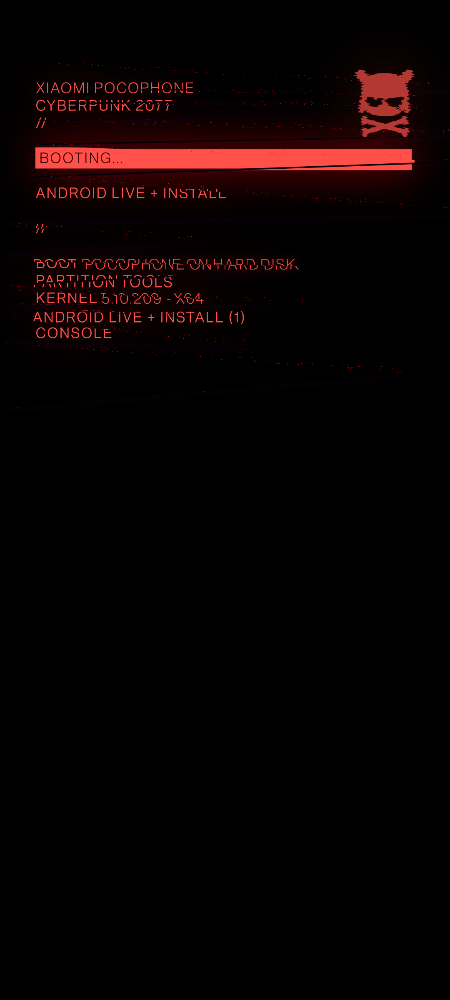

**语言**: [English](README.md) | [Русский](README.ru.md) | [Español](README.es.md) | [Français](README.fr.md) | [Português](README.pt.md) | [中文](README.zh.md)
# 赛博朋克 2077 启动动画和开机画面（POCO 专用）

本 Magisk 模块将默认启动动画替换为赛博朋克风格，灵感来源于 **OnePlus 8T Cyberpunk 2077 限定版**，并专为 **POCO** 设备重绘。模块还包含一个可选的自定义 **Splash 启动画面**。

---

### 原版动画：
<table>
  <tr>
    <td></td>
    <td></td>
    <td></td>
  </tr>
</table>

### POCO 定制动画：
<table>
  <tr>
    <td></td>
    <td></td>
    <td></td>
  </tr>
</table>

---

### 兼容性

适用于使用 **Magisk 20.4+** 的设备（不限于 POCO），且 bootanimation 位于以下路径之一：

```
/system/media/bootanimation.zip
/system/product/media/bootanimation.zip
/system/system_ext/media/bootanimation.zip
/product/media/bootanimation.zip
/vendor/media/bootanimation.zip
```

如果动画无效，请在 [Telegram 联系我](https://t.me/ENEIZEM)，以便我添加对您设备动画目录的支持。

---

### 安装方法

 1. 从 [Releases 下载模块](https://github.com/ENEIZEM/Magisk-Module-Cyberpunk-2077-Bootanimation-SplashScreen-POCO/releases)
 2. 打开 Magisk 应用
 3. 进入**“模块”**标签，选择下载的 `.zip` 文件安装

### 多语言安装日志

安装日志根据系统语言自动显示为：**中文、英文、俄文、西班牙文、法文或葡萄牙文**。

---

### 可选：Splash 启动画面

模块内含 `logo.zip` 文件（使用 [该工具](https://4pda.to/forum/index.php?showtopic=1023354&st=1580#entry114714184) 生成），包含：

 * **启动画面（POCO Logo）**
 * **FASTBOOT**
 * **系统损毁提示（destroyed）**

全部采用赛博朋克风格重绘。

### 原始画面：
<table>
  <tr>
    <td></td>
    <td></td>
    <td></td>
  </tr>
</table>

### 赛博朋克版本：
<table>
  <tr>
    <td></td>
    <td></td>
    <td></td>
  </tr>
</table>

---

> [!WARNING]
> 自定义 **Splash 启动画面** 仅推荐用于 **小米手机**，因为用于制作这些画面的工具是专门为小米设备设计的（且并非所有机型都支持）。
> 在不兼容设备刷入自定义启动画面可能导致硬件严重损坏，甚至 CPU 和主板不可修复的故障。
>
> **支持设备范围：**
> - MIUI 12.5 至 14
> - 安卓 11 至 13
>
> **绝不支持设备：**
> - Redmi Note 9、Redmi Note 9C 及更早型号
> - Redmi 9T 及更早型号
> - 小米 12、小米 12 Pro 及更早型号
> - 小米 8 及更早型号
> - POCO F4 GT 及更早型号
> - Redmi K50、Redmi K50G 及更早型号
>
> 安装前请务必确认设备支持，详情请联系 [工具作者](https://t.me/theskyfather)。

### 安装自定义启动画面步骤：

 1. 重启进入 **TWRP** 或其他第三方 Recovery
 2. 点击 **“安装”**
 3. 浏览到路径 `/data/adb/modules/Cyberpunk_2077_BA_SS/`
 4. 选择 `logo.zip` 并刷入

---

### 反馈

如果您有改进的想法，遇到任何错误，或者只是想分享您的想法，请随时联系我

[4pda 帖子](https://4pda.to/forum/index.php?showtopic=915158&view=findpost&p=138583478)

[支持本项目的资金捐助](https://www.donationalerts.com/r/eneizem)