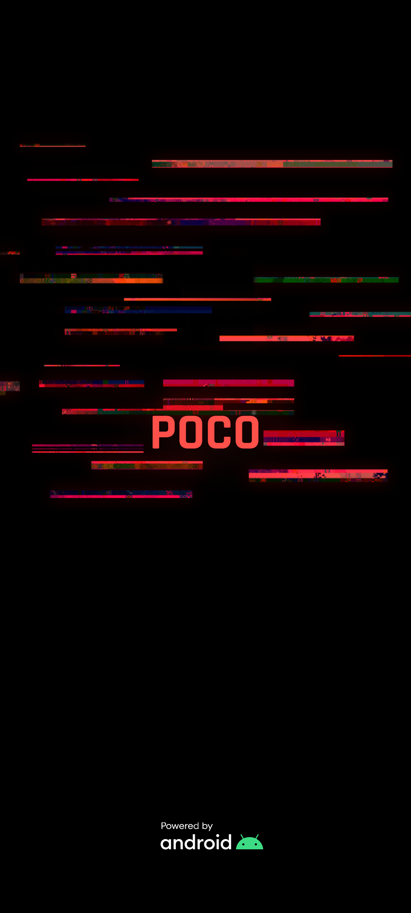

**语言**: [English](README.md) | [Русский](README.ru.md) | [Español](README.es.md) | [Français](README.fr.md) | [Português](README.pt.md) | [中文](README.zh.md)
# 赛博朋克 2077 启动动画和开机画面（POCO 专用） (中文)

本 Magisk 模块将默认启动动画替换为赛博朋克风格，灵感来源于 **OnePlus 8T Cyberpunk 2077 限定版**，并专为 **POCO** 设备重绘。模块还包含一个可选的自定义 **Splash 启动画面**。

---

### 原版动画：
 

### POCO 定制动画：
 

---

### 兼容性

适用于使用 **Magisk 20.4+** 的设备（不限于 POCO），且 bootanimation 位于以下路径之一：

```
/system/media/bootanimation.zip
/system/product/media/bootanimation.zip
/system/system_ext/media/bootanimation.zip
/product/media/bootanimation.zip
/vendor/media/bootanimation.zip
```

如果动画无效，请在 [Telegram 联系我](https://t.me/mbczqetuo)，以便我添加对您设备动画目录的支持。

---

### 安装方法

 1. 从 [Releases 下载模块](https://github.com/ENEIZEM/Magisk-Module-Cyberpunk-2077-Bootanimation-SplashScreen-POCO/releases)
 2. 打开 Magisk 应用
 3. 进入**“模块”**标签，选择下载的 `.zip` 文件安装

---

### 多语言安装日志

安装日志根据系统语言自动显示为：**中文、英文、俄文、西班牙文、法文或葡萄牙文**。

---

### 可选：Splash 启动画面

模块内含 `logo.zip` 文件（使用 [该工具](https://4pda.to/forum/index.php?showtopic=1023354&st=1580#entry114714184) 生成），包含：

 * **启动画面（POCO Logo）**
 * **FASTBOOT**
 * **系统损毁提示（destroyed）**

全部采用赛博朋克风格重绘。

### 原始画面：
  

### 赛博朋克版本：
  

---

### 重要：安装 Splash 启动画面

⚠️ 安装自定义 **Splash 启动画面**仅推荐用于 **Xiaomi 手机**，因为用于创建它们的工具是专门为 Xiaomi 设备设计的（即便如此，也并非所有型号都受支持）。
已在 **POCO F4 GT** 和 **Redmi Note 12 Turbo (POCO F5)** 上测试。

要刷入自定义的赛博朋克 Splash 图像：

 1. 进入 **TWRP** 或其他第三方 Recovery
 2. 点击 **“安装”**
 3. 路径如下：`/data/adb/modules/Cyberpunk_2077_BA_SS/`
 4. 选择 `logo.zip` 并刷入

---

### 反馈

如果您有改进的想法，遇到任何错误，或者只是想分享您的想法，请随时联系我